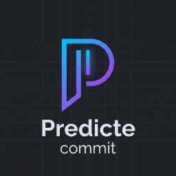

# Predicte Commit

  
  <h1>Predicte Commit: AI Commit Message Generator</h1>
  

    <b>Zero-Friction, Privacy-Aware AI Commit Messages for VS Code</b> 
    Powered by Mistral AI or Local LLMs (Ollama, vLLM, etc.)
  

**Predicte Commit** analyzes your staged changes and generates concise, descriptive commit messages using AI. It brings the magic of AI automation to your git workflow while keeping you in control.

_This extension is for developers who want to automate the tedious task of writing commit messages without leaving their source control view._

## ✨ Features

- **🚀 Zero-Friction**: Generate messages with a single click or command.
- **🔒 Privacy-Aware**: Built-in content filtering and explicit file ignores to keep secrets safe.
- **🤖 Flexible Providers**: Use **Mistral AI** (cloud) or your own **Local** instance (Ollama, vLLM, LM Studio).
- **🧠 Smart Truncation**: Automatically handles large diffs to stay within context windows.
- **⚡ Efficient**: Streamlined to provide quick results directly in your commit input box.

## 📦 Installation

1. Open the **Extensions** sidebar in VS Code (`Ctrl+Shift+X`).
2. Search for `Predicte Commit`.
3. Click **Install**.

## 🚀 Getting Started

1.  **Stage Changes**: Stage your files in the Source Control view as usual.
2.  **Generate Message**:
    *   Click the **Sparkle Icon** $(sparkle) in the Source Control title bar.
    *   *Or* open the Command Palette (`Ctrl+Shift+P`) and run **Predicte Commit: Generate Message**.
3.  **Review**: The generated message will appear in your commit input box. Edit if needed, then commit!

> **Note**: If using the Mistral provider (default), you will be prompted to enter your API key on the first run.

## ⚙️ Configuration

| Setting | Default | Description |
| :--- | :--- | :--- |
| `predicteCommit.provider` | `mistral` | AI provider to use (`mistral` or `local`). |
| `predicteCommit.models` | `[]` | List of models to use. If empty, uses provider defaults. |
| `predicteCommit.ignoredFiles` | `["*-lock.json", "*.svg", "dist/**"]` | Glob patterns to exclude from analysis. |
| `predicteCommit.useLocal` | `false` | Enable to use a local provider instead of Mistral. |
| `predicteCommit.localBaseUrl` | *(empty)* | Base URL for local provider (e.g., `http://localhost:11434/v1`). |
| `predicteCommit.localModel` | *(empty)* | Model name for local provider. |
| `predicteCommit.debugLogging` | `false` | Log prompt payload and diagnostics to the output channel. |

## 🤝 Contributing

We love contributions! Please read our [Contributing Guidelines](CONTRIBUTING.md) to get started.

## 📄 License

MIT © [Ga Satrya](https://github.com/gasatrya)
